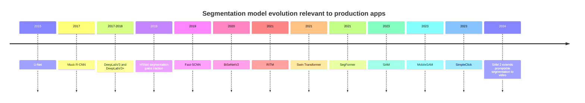
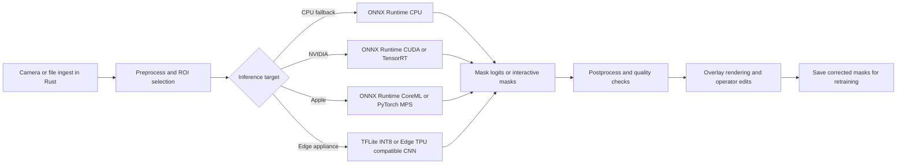

# Deep Image Segmentation for Commercial Native Applications

## Executive summary

For a commercial desktop application that needs image display, geometric overlays, and **interactive mask correction** by clicks or rough guidance, the strongest engineering pattern is a **two-track system**: use an interactive model immediately for operator-in-the-loop assistance, while in parallel collecting domain data to fine-tune a smaller, task-specific production model for automatic first-pass segmentation. Among the current families, **MobileSAM**, **RITM**, and **SimpleClick** are the most relevant interactive choices; for production-grade semantic segmentation after data collection, **SegFormer-B0/B1**, **BiSeNetV2**, **Fast-SCNN**, **LRASPP/MobileNetV3**, and selected **U-Net/DeepLab** variants are the most practical. This conclusion follows from their published architectures, checkpoint availability, latency/size trade-offs, and deployment paths. citeturn26view0turn25view0turn33view1turn29view1turn12view0turn12view2turn12view3turn37view2

If the target is a **commercially redistributable** product, the legal picture matters as much as the architecture. **SAM** and **MobileSAM** repositories are under **Apache-2.0**, and **RITM** and **SimpleClick** are under **MIT**, which are generally straightforward for commercial software. By contrast, the **official NVLabs SegFormer repository** uses the **NVIDIA Source Code License for SegFormer**, which explicitly limits use to **non-commercial** purposes; in practice, this means commercial teams often prefer an **Apache-2.0 implementation path** such as MMSegmentation for code, while still doing careful due diligence on any upstream pretrained checkpoints. The **SA-1B dataset** for SAM is separately governed by a **research dataset license**, so code/weights and dataset rights must not be conflated. citeturn26view0turn25view0turn33view0turn29view0turn22view0turn23search0turn23search2turn26view0

For deployment, the most robust cross-platform stack today is **Rust + ONNX Runtime** using the `ort` crate on the Rust side, with provider-based acceleration: **CUDA** or **TensorRT** on NVIDIA, **CoreML Execution Provider** on Apple platforms, and CPU fallback everywhere. **PyTorch MPS** is the primary “Metal” path for native PyTorch execution on macOS, while ONNX Runtime uses **CoreML**, not a first-party Metal execution provider. **TensorRT** is a premium path when you control NVIDIA hardware and need maximum latency reduction, especially with FP16 and INT8. **Edge TPU** is only a credible target for **small, fixed-shape, INT8 TFLite CNNs**; it is a poor fit for SAM-style or large transformer-based segmenters. citeturn42search0turn41view0turn41view2turn40search4turn43view0turn41view1turn40search1turn40search5turn41view3turn38view2

For your likely use case—industrial imagery such as glue inspection—a good default recommendation is this: start with **MobileSAM** if you want fast zero-shot prompting and an easier ONNX story, or **RITM / SimpleClick-xTiny or ViT-B** if you want a classical interactive annotator with lower legal and deployment ambiguity. Then, once you have enough corrected masks from real production images, shift the “automatic first guess” to a **small semantic model** like **SegFormer-B0**, **BiSeNetV2**, **Fast-SCNN**, or **LRASPP/MobileNetV3**, depending on your target hardware and latency budget. The interactive model remains in the product as a correction/refinement tool. citeturn25view0turn27view0turn33view1turn33view0turn31view0turn12view0turn12view2turn12view3turn37view2

## The segmentation landscape and decision framework

The major model families solve **different problems**, and that distinction matters operationally. **Interactive segmentation** aims to produce a high-quality mask from user prompts such as clicks, boxes, or an existing mask. **Semantic segmentation** predicts a per-pixel class label for the whole image. **Instance segmentation** predicts separate masks for each object instance. SAM explicitly frames its objective as **promptable segmentation**, designed for zero-shot transfer via prompts; classic interactive methods such as **RITM** and **SimpleClick** are optimized for repeated user correction; architectures like **U-Net**, **DeepLab**, **HRNet**, **SegFormer**, **BiSeNetV2**, and **Fast-SCNN** are primarily semantic segmentation models; **Mask R-CNN** is a canonical instance segmentation model. citeturn27view0turn33view1turn29view1turn34search0turn8search3turn16academia10turn19search6turn9search2

A practical decision rule is simple. If the operator must indicate “**this is the object**” and then rapidly refine boundaries, an **interactive** model is the right front end. If the product must eventually infer the mask **without user input** for a small, stable visual universe—such as glue, sealant, bead width, voids, or residue on a controlled manufacturing line—a smaller **semantic** model becomes the better long-term workhorse. SAM-like models excel at broad, zero-shot prompting, but their encoder cost is high unless heavily compressed; lightweight semantic models are less flexible, but are easier to quantize, easier to benchmark, and easier to run on CPU-only or edge-constrained hardware. citeturn27view0turn25view0turn12view0turn12view2turn12view3turn37view2

Prompt modality support is uneven across families, and this affects UI design.

| Family | Officially emphasized prompt modalities | Notes for UI design |
|---|---|---|
| SAM | Points, boxes, masks; initial text experiments discussed in paper | Official ONNX path covers the **mask decoder**, so the common pattern is to cache image embeddings and repeatedly query with prompts. citeturn27view0turn26view0 |
| MobileSAM | Same prompting pipeline as SAM; points and boxes demonstrated | Official repo says it keeps the same pipeline and interfaces as SAM, with a smaller image encoder. citeturn25view0 |
| RITM | Clicks and **previous mask / external mask** | Especially good for “start from rough mask, then correct” workflows. citeturn33view1turn33view0 |
| SimpleClick | Click-based interactive segmentation | Strong fit for annotation tools centered on positive/negative clicks. citeturn29view1turn29view0 |
| Semantic models | No native prompting | Best used as automatic first-pass segmenters, optionally refined by an interactive model. citeturn34search0turn8search3turn19search6 |
| Mask R-CNN | Box proposals within detector pipeline | Instance masks depend on detector quality and class definitions rather than direct operator prompts. citeturn9search2turn36search3 |

Training needs are similarly asymmetric. **SAM** was created for large-scale zero-shot transfer and can be useful immediately without task-specific training, but **RITM** explicitly reports that training dataset choice strongly affects interactive quality, and **SimpleClick** shows that pretrained ViTs can generalize well even out of domain, including medical images, without fine-tuning. For industrial deployment, the right takeaway is not “training is always required” or “pretraining is enough,” but rather: **pretrained interactive models are enough to start**, while **fine-tuning a smaller task-specific model usually becomes worthwhile once production data accumulates**. citeturn27view0turn33view1turn29view1turn31view0

The dates and lineage above follow the original papers and official repositories. citeturn34search0turn9search2turn8search3turn16academia10turn13view6turn9search3turn33view1turn18view0turn19search6turn8search0turn25view0turn29view1turn28search1

## Interactive segmentation models

### SAM and the SAM family

SAM’s core design is an **image encoder + prompt encoder + lightweight mask decoder**. Meta’s paper says the image embedding is computed once, then reused for prompt queries, and the **prompt encoder + mask decoder can run in about 50 ms in a web browser given a precomputed image embedding**. The prompt scheme explicitly covers **points, boxes, and masks**, and the model is designed to return **multiple candidate masks** for ambiguous prompts. The official repository distributes three checkpoint families—**ViT-B, ViT-L, ViT-H**—and provides an official script to export the **mask decoder** to ONNX. The repository itself is licensed under **Apache-2.0**, while the **SA-1B dataset** is covered by a separate research license. citeturn27view0turn26view0

The practical implication is that SAM is best when you want a **general-purpose interaction primitive** with zero-shot reach and you can afford a heavier encoder, or when you can **cache embeddings** and keep interaction focused on prompt decoding. In a desktop inspection tool, that means SAM is more attractive for still images or paused frames than for raw high-FPS per-frame re-embedding, unless you have strong GPU resources or aggressive ROI cropping. It is considerably more deployment-friendly than many foundation models because the code license is permissive and the official repo documents the ONNX export path for the mask decoder. citeturn27view0turn26view0turn41view0

**SAM 2** extends the same promptable idea to video and images through **streaming memory**, with Meta emphasizing real-time interactive video processing. For still-image industrial inspection, SAM 2 is more relevant if you eventually need temporal propagation across video or multi-frame inspection sequences; for single images, it is part of the broader SAM family, not automatically the best default. The official SAM 2 repository is public and the code release is presented by Meta under **Apache-2.0**. citeturn28search1turn28search3turn28search2

### MobileSAM

MobileSAM is one of the clearest examples of a **commercially plausible lightweight interactive model**. The official repository states that it keeps **exactly the same prompting pipeline as SAM**, but replaces the heavy ViT-H image encoder with a much smaller **Tiny-ViT encoder**. The repo reports the following comparison for the full pipeline: **Original SAM ~615M parameters and ~456 ms**, versus **MobileSAM ~9.66M parameters and ~12 ms** on a single GPU; the image encoder portion shrinks from **611M** to **5M** parameters, while the prompt-guided decoder remains the same size. The repo is under **Apache-2.0** and ships an **official ONNX export** script for the model. citeturn25view0

That combination—**same UX as SAM, much smaller model, official ONNX export, permissive license**—makes MobileSAM an unusually strong fit for commercial interactive desktop software. It is particularly attractive when your UX centers on “click here / box this / refine that,” and when you want a lower-risk path to **Rust + ONNX Runtime** than a large research pipeline with custom ops and unclear export support. The cost is that MobileSAM is still a promptable foundation-model derivative, not an ultra-tiny deterministic production segmenter; it is small **relative to SAM**, not relative to **Fast-SCNN** or **LRASPP**. citeturn25view0turn41view0turn42search0

### RITM

RITM—**Reviving Iterative Training with Mask Guidance**—is a classic interactive segmentation line optimized around **feedforward click-based correction** rather than giant pretrained foundation-model behavior. The paper emphasizes that it avoids expensive inference-time optimization schemes and instead uses a **simple feedforward model with previous-step mask guidance**, allowing both segmentation from clicks and **correction of an externally provided mask**. The official repository distributes pretrained models with several **HRNet-based backbones**, including **HRNet18s**, **HRNet18**, and **HRNet32**, and lists checkpoint sizes of roughly **16.5 MB, 38.8 MB, and 119 MB** respectively. The repository is under **MIT**. citeturn33view1turn33view0

A useful data point comes from the SimpleClick paper’s computational comparison table, which includes the same HRNet-family interactive baselines: **HR-18s ~4.22M params / 17.94 GFLOPs**, **HR-18 ~10.03M / 30.99 GFLOPs**, and **HR-32 ~30.95M / 83.12 GFLOPs**. Those are compelling sizes for a commercial annotation/correction tool because they are far smaller than SAM-style encoders while remaining purpose-built for iterative user correction. RITM’s paper also explicitly says that the **choice of training dataset strongly impacts interactive quality**, which is an important operational lesson for industrial deployment. citeturn31view0turn33view1

RITM is especially attractive if your UX involves **rough initialization followed by fast correction**, such as loading a previous automatic mask, editing that mask, and preserving operator intent. Its main limitation relative to MobileSAM is weaker zero-shot generality and a less explicit official ONNX story in the reviewed sources; its main strength is a smaller, more classical architecture with a permissive license and straightforward correction semantics. citeturn33view0turn33view1

### SimpleClick

SimpleClick is the most technically interesting of the modern classical interactive families because it uses **plain ViTs** rather than the hierarchical backbones more common in earlier interactive systems. The ICCV paper describes it as the **first plain-backbone method for interactive segmentation**, with strong results from MAE-pretrained ViTs and an explicit “practical annotation tool” analysis. The official repository is under **MIT**, provides checkpoints, and documents training/evaluation on **SBD**, **COCO+LVIS**, **GrabCut**, **Berkeley**, **DAVIS**, **PascalVOC**, and several medical datasets. citeturn29view1turn29view0

SimpleClick’s computational table is unusually useful for product decisions. It reports **ViT-xTiny: 3.72M params, 10.52 GFLOPs at 448 input, 29 ms per click**; **ViT-B: 96.46M params, 169.78 GFLOPs, 54 ms/click**; **ViT-L: 322.18M params, 532.87 GFLOPs, 86 ms/click**; and **ViT-H: 659.39M params, 1401.93 GFLOPs, 132 ms/click**, all measured on the same benchmark computer with an **NVIDIA RTX A6000** and dual **Intel Silver** CPUs. The paper explicitly argues that even the large ViT-H setting is still practical as an annotation tool, and the xTiny variant is clearly aimed at constrained environments. citeturn31view0

For a commercial native app, the most compelling SimpleClick configurations are **xTiny** and **ViT-B**. xTiny is attractive when you want an interactive tool that still feels modern but is much closer to deployable desktop latency; ViT-B is more accuracy-oriented when you can rely on GPU. Compared with RITM, SimpleClick offers a stronger transformer story and cleaner published compute analyses; compared with MobileSAM, it is typically a better choice when you care more about **interactive annotation efficiency on known object styles** than zero-shot generality across arbitrary scenes. citeturn29view1turn31view0

## Semantic, instance, and lightweight production models

The main production question is not “which model is best overall,” but “which model best matches my **label space**, **latency budget**, and **hardware floor**?” U-Net variants, DeepLab, HRNet, SegFormer, BiSeNetV2, Fast-SCNN, and MobileNet/EfficientNet-lite-based models occupy different points on this frontier. U-Net remains the classic encoder-decoder with skip connections; **UNet++** deepens and densifies skip pathways; **Attention U-Net** adds attention gates; **nnU-Net** turns U-Net-like segmentation into a self-configuring recipe rather than a single frozen architecture. Those families are strongest when you own the data and can fine-tune in-domain. citeturn34search0turn34search11turn34search1turn34search2

DeepLab’s core strengths remain **atrous convolution** and multiscale context aggregation. DeepLabV3 revisits atrous convolution and ASPP, while DeepLabV3+ adds a decoder for boundary refinement. In OpenMMLab’s published model tables, DeepLabV3 remains a strong accuracy baseline but is meaningfully slower than the lightweight mobile families. In the SegFormer supplementary material, **DeepLabV3+ with ResNet-50** is listed at **43.7M parameters** on COCO-Stuff, giving a useful representative size for the family. citeturn14view0turn8search3turn20view0

HRNet is the representative “keep high-resolution features alive” family. The official semantic-segmentation repository emphasizes its parallel multi-resolution design and distributes pretrained segmentation checkpoints, including **HRNetV2-W48** and **HRNetV2-W48 + OCR** variants pretrained from ImageNet. In the broader segmentation ecosystem, HRNet remains a strong option when fine detail matters, but it is rarely the best choice if your first constraint is edge/mobile inference. citeturn15view0turn16search1

Mask R-CNN remains the canonical instance segmentation workhorse for **multiple objects and class-aware instance masks**. The original paper reports about **5 FPS** and frames the method as an extension of Faster R-CNN with a parallel mask branch. TorchVision provides pretrained Mask R-CNN models, and its source documentation states that **Mask R-CNN is exportable to ONNX for fixed batch size and fixed image size**. For industrial inspection, Mask R-CNN is the right answer when multiple instances and detector-style semantics are central; it is the wrong answer if you mainly need **one foreground object or material region** and interactive refinement. citeturn9search2turn36search7turn36search3

Lightweight production models deserve disproportionate attention because they are where commercial apps usually land after the annotation phase. **Fast-SCNN** is explicitly pitched as “above real-time” segmentation for high-resolution images on embedded devices. OpenMMLab reports **56.45 FPS** on a V100 for a **512×1024** Cityscapes configuration. **BiSeNetV2** separates detail and semantic branches for real-time work; OpenMMLab reports about **31.77 FPS** on a V100 at **1024×1024**, or **36.65 FPS** for an FP16-trained variant. **LRASPP with MobileNetV3-Large** in TorchVision is only **3.22M parameters** and **2.09 GFLOPs**, which is exceptionally attractive for CPU fallback or mobile-class deployment. **EfficientNet-lite** is not itself a segmentation head, but Google’s official EfficientNet-lite line is explicitly designed for mobile/IoT and Edge TPU friendliness, with models from **4.7M to 13.0M parameters** and published Pixel 4 latencies for both FP32 and INT8. citeturn13view6turn13view5turn13view3turn13view4turn37view2turn38view2

Transformer-based semantic segmentation has now split into two camps. **Swin** remains a heavyweight hierarchical transformer backbone that works well with decoder heads like **UPerNet**. The official segmentation repo reports **Swin-T UPerNet: 60M params / 945G FLOPs**, **Swin-S: 81M / 1038G**, and **Swin-B: 121M / 1188G**, with published ADE20K results and V100 FPS. **SegFormer**, by contrast, is explicitly engineered to be simpler and lighter: the NeurIPS paper scales the MiT encoder from **B0 to B5**, with encoder parameters from **3.4M to 81.4M**, and highlights **B4 at 64M parameters** for strong ADE20K performance. OpenMMLab’s SegFormer tables then show the practical latency trend from **MIT-B0 at 51.32 FPS** down to **MIT-B5 at 11.89 FPS** on benchmark GPUs. citeturn24view0turn20view0turn12view0

### Comparative table of top deployment candidates

The table below mixes **published metrics** and **practical deployment interpretation**. GPU speeds are the published numbers from each source context; they are **not normalized across hardware**. The “CPU / edge expectation” column is an engineering synthesis from published model size/FLOPs, official runtime support, and vendor latency guidance, and should be treated as an initial filter, not a purchasing guarantee. citeturn25view0turn31view0turn12view0turn24view0turn37view2turn38view2turn41view0turn41view3

| Model family | Representative architecture | Typical size | Input / benchmark context | Published GPU speed | CPU / edge expectation | License status | ONNX path | Best use |
|---|---|---:|---|---:|---|---|---|---|
| SAM | ViT-B / L / H promptable segmentation | MobileSAM repo reports original SAM full pipeline at **~615M params**; official repo distributes ViT-B/L/H checkpoints citeturn25view0turn26view0 | Encoder cached; prompt decoder queried repeatedly | Mask decoder + prompt encoder can run in **~50 ms in browser** with cached embedding citeturn27view0 | Poor on CPU for full-image re-embedding; viable if embeddings are cached or ROI-cropped | **Apache-2.0** for code; SA-1B dataset is separately licensed for research citeturn26view0 | **Official decoder-only ONNX export** citeturn26view0 | Zero-shot interactive segmentation, annotation tools |
| MobileSAM | Tiny-ViT encoder + SAM decoder | **~9.66M params** full pipeline; image encoder **5M**; repo reports same SAM decoder size citeturn25view0 | Same pipeline as SAM | **~12 ms/image** on single GPU in repo comparison citeturn25view0 | Fair on desktop CPU for interactive stills; not intended for ultra-small edge accelerators | **Apache-2.0** citeturn25view0 | **Official ONNX export** in repo citeturn25view0 | Best “drop-in” commercial interactive assistant |
| RITM | HRNet18s / 18 / 32 with mask guidance | **4.22M / 10.03M / 30.95M** representative interactive backbones; official checkpoints roughly **16.5 / 38.8 / 119 MB** citeturn31view0turn33view0 | Click-based interactive correction | Repo emphasizes feedforward interactive use; no unified official latency table in reviewed sources citeturn33view1turn33view0 | Good for desktop CPU/GPU interactive correction at moderate resolutions | **MIT** citeturn33view0 | No official exporter documented in reviewed sources; custom export likely required | Mask correction, editing existing rough masks |
| SimpleClick | ViT-xTiny / B / L / H | **3.72M / 96.46M / 322.18M / 659.39M** citeturn31view0 | 224 or 448 square interactive benchmark | **29 / 54 / 86 / 132 ms per click** on RTX A6000 depending variant citeturn31view0 | xTiny is plausible on CPU; larger ViTs want GPU | **MIT** citeturn29view0 | No official ONNX exporter documented in reviewed sources | High-quality interactive annotation, strong transformer baseline |
| LRASPP | MobileNetV3-Large segmentation | **3.22M params, 2.09 GFLOPs** citeturn37view2 | 520 resize in TorchVision weights | No official GPU latency in reviewed source | Excellent CPU/embedded fallback candidate | Commercial-friendly implementation path exists; representative TorchVision model documented with pretrained weights, but exact code-license source was not re-opened here | Standard PyTorch/ONNX path is usually straightforward; verify in chosen implementation | Small-footprint automatic semantic first-pass |
| Fast-SCNN | Real-time CNN | OpenMMLab performance tables available; primary source frames it as embedded real-time architecture citeturn13view6 | Cityscapes 512×1024 | **56.45 FPS** on V100 in mmseg table citeturn13view5 | Very strong CPU/embedded candidate | Implementation-dependent; OpenMMLab codebase is **Apache-2.0** citeturn23search0 | Supported through MMSegmentation/MMDeploy deployment workflow broadly citeturn11search8turn42search13 | Production semantic segmentation under tight latency budgets |
| BiSeNetV2 | Bilateral real-time CNN | Real-time family; official paper + OpenMMLab checkpoints available citeturn9search3turn12view2 | Cityscapes 1024×1024 | **31.77 FPS**, or **36.65 FPS** for FP16-trained variant, on V100 in mmseg tables citeturn13view3turn13view4 | Good CPU/embedded candidate if ops are simple and image sizes controlled | Implementation-dependent; OpenMMLab codebase is **Apache-2.0** citeturn23search0 | Supported through MMSegmentation/MMDeploy workflow broadly citeturn11search8turn42search13 | Real-time production semantic segmentation |
| DeepLabV3+ | ResNet-50 | **43.7M params** representative published size citeturn20view0 | Multiple OpenMMLab configs; 512×512 or 512×1024 common | OpenMMLab reports **10–15 FPS** bands for common V100 configs depending backbone/settings citeturn14view3 | Acceptable on strong CPUs only at modest resolutions; prefers GPU | Official TensorFlow Model Garden code path is **Apache-2.0** citeturn36search0turn36search8 | Strong ONNX/TensorRT deployment path via MMDeploy/MMSeg workflows citeturn11search8turn36search6turn42search13 | Accuracy-first semantic baseline |
| SegFormer | MiT-B0 to B5 + MLP decoder | MiT encoder sizes **3.4M to 81.4M**; paper highlights **B4 at 64M params**; decoder is intentionally tiny citeturn20view0turn19search6 | ADE20K / Cityscapes configs; 512 square common | OpenMMLab reports **51.32 FPS** for B0 down to **11.89 FPS** for B5 on benchmark GPUs citeturn12view0 | B0/B1 are realistic for desktop; larger variants want GPU | **Official NVLabs repo is non-commercial**; Apache-2.0 implementation paths exist in OpenMMLab, but checkpoint provenance must be checked citeturn22view0turn23search0 | Convertible via MMSegmentation/MMDeploy workflow broadly citeturn11search8turn42search13 | Strong all-around semantic model if licensing is handled correctly |
| Swin segmentation | Swin-T/S/B with UPerNet | **60M / 81M / 121M params** and **945G / 1038G / 1188G FLOPs** in official segmentation repo citeturn24view0 | ADE20K 512×512 | Official repo provides benchmarked ADE20K configs; heavier than SegFormer-B0/B1 class citeturn24view0 | Generally GPU-first | **Apache-2.0** in official segmentation repo citeturn24view0 | Conversion supported through mmseg-style workflows and checkpoint conversion scripts citeturn18view0turn11search8 | Accuracy-oriented transformer semantic segmentation |
| Mask R-CNN | ResNet-50-FPN instance segmentation | Varies materially by backbone/FPN; official paper and TorchVision docs reviewed here do not provide a unified parameter figure | Detection + instance segmentation | Original paper reports about **5 FPS** citeturn9search2 | Heavy for CPU-only interactive UX | License depends on chosen implementation; representative commercial-friendly implementations exist, but exact repo choice matters | TorchVision source states **ONNX export works for fixed batch and fixed image size** citeturn36search7 | Multi-instance, class-aware segmentation |

The brief conclusion from the table is straightforward: **MobileSAM** is the cleanest interactive “assistant” choice; **RITM** and **SimpleClick-xTiny / ViT-B** are the clearest interactive “annotation-tool” choices; **Fast-SCNN**, **BiSeNetV2**, and **LRASPP/MobileNetV3** are the strongest lightweight production choices; **SegFormer-B0/B1** is the strongest modern transformer choice if you can resolve the licensing path cleanly; and **DeepLabV3+** remains a dependable, respectable baseline when you want a known quantity rather than the newest architecture. citeturn25view0turn33view0turn31view0turn13view5turn13view3turn37view2turn12view0turn20view0

## Runtimes, hardware, and deployment patterns

ONNX Runtime is the most practical neutral runtime layer because it is built around **execution providers**. The official documentation lists CPU by default and additional providers including **CUDA**, **TensorRT**, **DirectML**, **OpenVINO**, **CoreML**, **XNNPACK**, and ARM-focused options. That makes it especially attractive for a Rust-native application that may need to run on several hardware classes without changing the high-level inference API. In Rust, the `ort` crate explicitly describes itself as a Rust binding to ONNX Runtime. citeturn41view0turn42search0turn42search8

On NVIDIA hardware, there are two distinct acceleration tiers. The **CUDA Execution Provider** is the general-purpose baseline for ONNX Runtime on CUDA-enabled GPUs; the docs call out version and cuDNN compatibility explicitly, including the current CUDA 12.x packaging defaults. The **TensorRT Execution Provider** is the higher-performance path where ONNX Runtime delegates supported subgraphs to TensorRT. NVIDIA’s current TensorRT support matrix says TensorRT supports hardware with **compute capability SM 7.5 or higher**, and the matrix is explicitly the source of truth for precision-mode support such as **FP16**, **INT8**, **BF16**, and newer reduced-precision modes on newer architectures. In a product line where NVIDIA GPUs are controlled, TensorRT is usually the best “premium SKU” path. citeturn41view2turn40search4turn43view0

On Apple platforms, the practical split is clear. **PyTorch MPS** is the native “Metal” path for PyTorch execution, and the PyTorch notes say the MPS backend maps graphs and primitives onto **Metal Performance Shaders Graph** and optimized kernels. **ONNX Runtime**, by contrast, uses the **CoreML Execution Provider**, which is documented as leveraging Apple **CPU, GPU, and Neural Engine** and requiring **iOS 13+** or **macOS 10.15+**. For commercial desktop software, that means “Metal support” typically means **PyTorch MPS if you stay in PyTorch**, or **CoreML EP if you standardize on ONNX Runtime**. citeturn40search1turn40search5turn41view1

Edge TPUs are much more restrictive. Coral’s official documentation says a model must use **8-bit quantized tensors**, **fixed tensor sizes**, **compile-time-constant parameters**, and **only supported Edge TPU operations**. Unsupported graph portions remain on CPU, and Coral explicitly warns that even a small unsupported fraction can slow inference **by an order of magnitude** relative to a fully compatible model. Google’s **EfficientNet-lite** line is a useful reference here because it is explicitly designed to run well on **mobile CPU/GPU/EdgeTPU**, with published Pixel 4 and Edge TPU latencies and post-training INT8 export paths. The consequence is simple: **Edge TPU is a target for tiny CNN-style semantic models, not for SAM-like interactive transformers**. citeturn41view3turn38view2

A mature commercial architecture therefore looks like this:

This split is supported by the runtime ecosystems and is also the most natural way to structure a Tauri or hybrid desktop app: keep **acquisition, preprocessing, inference, and model memory in Rust/native code**, and treat the frontend as the **presentation and interaction layer**. Tauri’s documentation emphasizes Rust commands from the frontend and frontend communication from Rust through events/channels; that is a good fit for **control-plane messaging**, while image buffers and model state are best kept out of the browser UI state machine whenever possible. citeturn42search2turn42search6turn42search18turn42search0

Quantization and precision control are not optional details in this space. ONNX Runtime’s official quantization docs define its INT8 tooling around 8-bit linear quantization and provide the standard route for ONNX model quantization. TensorRT’s support matrix and EP documentation then determine whether a given target GPU can exploit **FP16** or **INT8** efficiently. In practice, a sensible commercial deployment ladder is: **FP32 for correctness**, **FP16 for NVIDIA/Apple acceleration**, and **INT8** only after validating mask quality carefully, especially around thin structures and boundaries. For throughput-oriented back-end processing, batching can help; for operator-in-the-loop interaction, **batch size 1** usually wins because latency matters more than throughput. citeturn42search3turn42search15turn40search4turn43view0

## Licensing, datasets, and benchmark design

The most important legal caveat is that **architecture names are not licenses**. You do not license “U-Net” or “Mask R-CNN” as abstractions; you license **a specific codebase**, **specific checkpoints**, and sometimes a **specific dataset** used to create or fine-tune those checkpoints. This is why some families in the table above are marked “implementation-dependent.” The issue is especially important for transformer-era models because code, papers, converted weights, and upstream pretraining often come from different places. citeturn29view1turn22view0turn23search0turn26view0

The sharpest licensing warning in the reviewed sources is **SegFormer**. The **official NVLabs SegFormer repository** uses the **NVIDIA Source Code License for SegFormer**, whose Section 3.3 states that the work and derivative works may only be used **non-commercially**. By contrast, **MMSegmentation** is under **Apache-2.0** and implements SegFormer alongside many other families, but that does not automatically erase any restrictions that may attach to checkpoints converted from the official repo. If your business depends on commercial redistribution, you should treat official SegFormer assets as a formal legal review item rather than assuming that the architecture is “open source enough.” citeturn22view0turn23search0turn12view0

The most commercially comfortable reviewed families are **SAM / MobileSAM** on the code side, plus **RITM**, **SimpleClick**, and Swin’s official semantic-segmentation repo, because their repo licenses in the reviewed sources are permissive. The subtlety with SAM is the **dataset**: the official repo is under **Apache-2.0**, but the **SA-1B dataset** is released under a separate research dataset license. That distinction matters if you intend to redistribute data, derive datasets, or reuse released assets in ways beyond model inference. citeturn26view0turn25view0turn33view0turn29view0turn24view0

For evaluation, the dataset split should match the task family. For **interactive segmentation**, the canonical benchmarks used by RITM and SimpleClick include **GrabCut**, **Berkeley**, **DAVIS**, **SBD**, and **Pascal VOC**, with metrics such as **NoC@85**, **NoC@90**, and **mIoU@k clicks**. For **semantic segmentation**, the common benchmarks in the reviewed sources are **Cityscapes**, **ADE20K**, **Pascal VOC**, **Pascal Context**, and **COCO-Stuff**, with **mIoU** and pixel accuracy dominating. For **instance segmentation**, **Mask R-CNN** is conventionally evaluated with **mask AP** on COCO. If your product is industrial and closed-world, you should still use these public datasets for initial calibration, but your final selection must be driven by an **in-domain benchmark** assembled from real production imagery. citeturn33view0turn29view0turn31view0turn12view0turn12view1turn24view0turn9search2

A minimal but rigorous benchmark plan for your product can stay small:

| Benchmark track | What to measure | Suggested datasets / data | Why it matters |
|---|---|---|---|
| Interactive quality | NoC@85, NoC@90, mIoU after 1/3/5 clicks | GrabCut, Berkeley, DAVIS, SBD, PascalVOC; plus your own operator-click traces | Measures how much operator effort the model saves. citeturn33view0turn29view0turn31view0 |
| Automatic segmentation quality | mIoU, Dice / F1, boundary-aware quality if thin glue lines matter | Cityscapes/ADE20K only for sanity; final decision on your own industrial dataset | Public datasets calibrate; private data decides. citeturn12view0turn12view1turn15view0 |
| Instance quality | mask AP if separate objects matter | COCO-style internal annotations if multiple glue blobs/components matter | Necessary only if individual object identity matters. citeturn9search2 |
| Latency | Warm and cold latency, p50/p95, batch=1, ROI sizes, embedding-cache hit rate | Test on at least one CPU-only machine, one Apple machine, and one NVIDIA machine | Determines perceived UX quality and fallback viability. citeturn41view0turn41view2turn41view1turn43view0 |
| Robustness | Lighting shift, blur, defocus, motion, specular highlights, contamination | Synthetic perturbations plus real defect cases | Industrial performance is usually killed by edge cases, not averages. citeturn20view0 |

For a product roadmap, the most ergonomic pipeline is usually this: use an interactive model to reduce labeling cost; save operator corrections; train a small semantic model for default masks; then keep the interactive model in the loop only for exceptions and edits. That approach is consistent with how SAM’s data engine is described at scale, how RITM emphasizes correction via previous masks, and how SimpleClick positions itself as a practical annotation tool. citeturn27view0turn33view1turn31view0

### Recommended shortlist for a commercial native app

If the product must ship soon and you want the lowest integration risk, the shortlist is:

| Need | Best first choice | Why |
|---|---|---|
| Zero-shot interactive assistant | **MobileSAM** | Same prompt UX as SAM, much smaller, Apache-2.0, official ONNX export. citeturn25view0 |
| Correction of rough masks | **RITM HRNet18s / HRNet18** | MIT, smaller models, previous-mask guidance is first-class. citeturn33view1turn33view0turn31view0 |
| Highest-quality interactive annotation with published compute analysis | **SimpleClick xTiny or ViT-B** | Excellent interactive results with clear size/speed trade-offs and MIT license. citeturn29view1turn29view0turn31view0 |
| Small automatic first-pass model | **LRASPP/MobileNetV3**, **Fast-SCNN**, or **BiSeNetV2** | Best lightweight latency class; strong fallback candidates for CPU and constrained GPUs. citeturn37view2turn13view5turn13view3 |
| Accuracy-oriented automatic model | **SegFormer-B0/B1** or **DeepLabV3+ ResNet50** | Strong semantic baselines, but SegFormer licensing must be validated carefully. citeturn12view0turn20view0turn22view0 |

### Open questions and limitations

Some details remain implementation-specific and should be validated inside your exact stack. The biggest open legal item is **checkpoint provenance** for families like SegFormer when mixing official assets and Apache-licensed reimplementations. The biggest technical uncertainty is that **published latency numbers are not cross-hardware apples-to-apples**: SAM browser timings, MobileSAM repo timings, A6000 per-click timings, V100 FPS, Pixel 4 mobile latency, and TensorRT feature support are all useful, but they are not a normalized benchmark. Finally, in the reviewed primary sources, **RITM** and **SimpleClick** do not document a first-party ONNX export flow as explicitly as SAM and MobileSAM do, so a production ONNX export path for those models should be treated as an engineering validation item rather than an assumption. citeturn25view0turn26view0turn31view0turn12view0turn38view2turn22view0